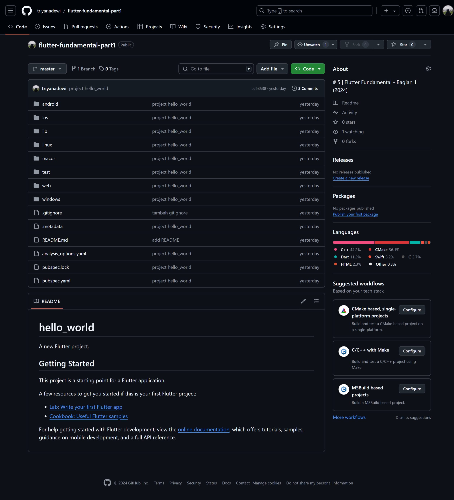

# hello_world

A new Flutter project.

## Identitas Mahasiswa

> Nama  : Triyana Dewi Fatmawati  
> NIM   : 2241720206  
> Kelas : TI - 3H  
> Nomor : 25  

---

### Praktikum 1: Membuat Project Flutter Baru
Jika proses pembuatan project baru hello_world selesai, maka akan ditampilkan pesan berupa "Your Flutter Project is ready!" artinya project telah berhasil dibuat.

### Praktikum 2: Menghubungkan Perangkat Android atau Emulator
Untuk menghubungkan aplikasi di Android Studio ke perangkat Android fisik kita dapat menghubungkan perangkat menggunakan kabel/USB atau Wi-Fi. Berikut tampilan pada Android Studio ketika proses penyambungan dengan perangkat fisik berhasil.

### Praktikum 3: Membuat Repository GitHub dan Laporan Praktikum
#### Langkah 10 
Melakukan push untuk semua file pada projek hello_world dengan pilih Stage All Changes. Lalu memberi pesan commit "project hello_world". Maka akan tampil di repository GitHub seperti berikut.

#### Langkah 11 
Running project hello_world dengan tekan F5 atau Run > Start Debugging. Tunggu proses kompilasi hingga selesai, maka aplikasi flutter pertama akan tampil seperti berikut.
- Google Chrome
    

- Android
    

    

#### Langkah 12
Melakukan praktikum seperti Langkah 11, namun teks yang ditampilkan dalam aplikasi berupa nama lengkap.

- Google Chrome
    

- Android
    
    
    

### Praktikum 4: Menerapkan Widget Dasar
#### Langkah 1: Text Widget
Buat folder baru basic_widgets di dalam folder lib. Kemudian buat file baru di dalam basic_widgets dengan nama text_widget.dart.

Melakukan import file text_widget.dart ke main.dart

- Google Chrome
    

- Android
    
  
    

#### Langkah 2: Image Widget
Buat sebuah file image_widget.dart di dalam folder basic_widgets.

Melakukan penyesuaian asset pada file pubspec.yaml dan menambahkan file logo Anda di folder assets project hello_world.

Melakukan import file image_widget.dart ke main.dart

- Google Chrome
    

- Android
    
  
    

### Praktikum 5: Menerapkan Widget Material Design dan iOS Cupertino
Pada praktikum 5 mulai dari Langkah 3 sampai 6, membuat file widget tersendiri di folder basic_widgets, kemudian pada file main.dart cukup melakukan import widget sesuai masing-masing langkah.

#### Langkah 3: Scaffold Widget
Scaffold widget digunakan untuk mengatur tata letak sesuai dengan material design.

- Google Chrome
    
    Ketika Button + diklik maka nilai counter akan bertambah 1. Seperti pada gambar berikut.
    

- Android
    

#### Langkah 4: Dialog Widget
Dialog widget pada flutter memiliki dua jenis dialog yaitu AlertDialog dan SimpleDialog.

- Google Chrome
    
    Ketika button "Show alert" diklik maka akan muncul dialog My Message, yang didalamnya terdapat message berupa "Hello! I'm Triyana Dewi Fatmawati" Seperti gambar berikut.

    

- Android
    

#### Langkah 5: Input dan Selection Widget
Flutter menyediakan widget yang dapat menerima input dari pengguna aplikasi yaitu antara lain Checkbox, Date and Time Pickers, Radio Button, Slider, Switch, TextField.

- Google Chrome
    
    Pada hasil praktikum langkah ini, terdapat text field yang dapat diinputkan nama, berikut contohnya.
    

- Android
    

#### Langkah 6: Date and Time Pickers
Date and Time Pickers termasuk pada kategori input dan selection widget, berikut adalah contoh penggunaan Date and Time Pickers.

- Google Chrome
    
    Pada hasil praktikum langkah ini, menampilkan tanggal hari ini namun bisa disesuaikan/ganti dengan klik button "Pilih Tanggal". Berikut tampilan ketika button tersebut diklik
    

    Bisa kita sesuaikan, disini saya menggantinya dengan tanggal 28 Januari 2024
    

    Setelah diklik OK maka tanggal yang ditampilkan akan berganti menjadi 2024-01-28 (sesuai dengan tanggal yang dipilih sebelumnya)
    

- Android
    

### Codelabs: Your first Flutter app
**Perintah!** Selesaikan Codelabs: Your first Flutter app, lalu buatlah laporan praktikumnya dan push ke repository GitHub Anda! 
 
**Link pengerjaan** : [Tugas 4 - namer_app](https://github.com/triyanadewi/namer_app)